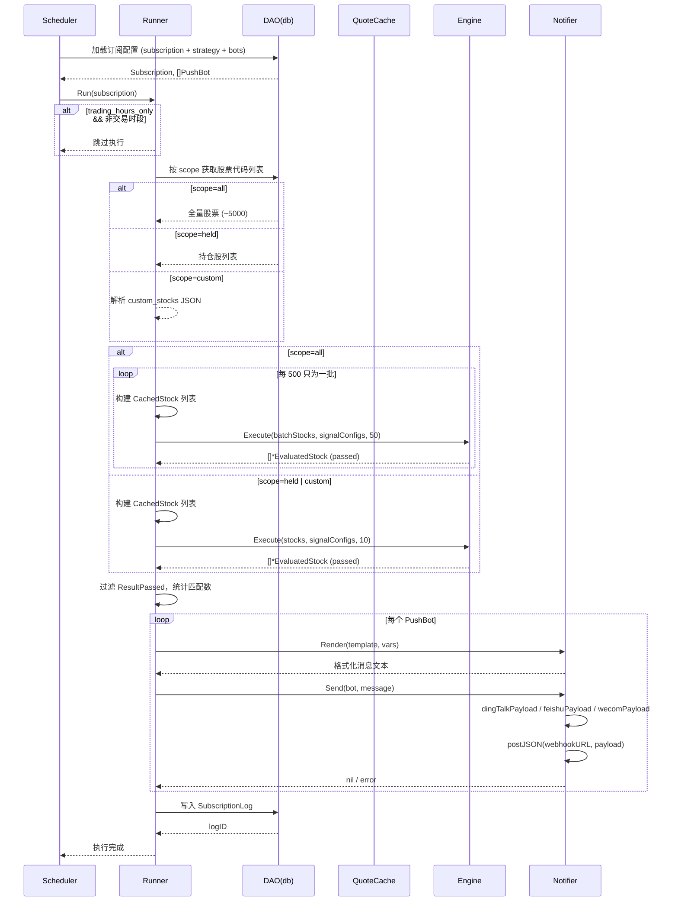
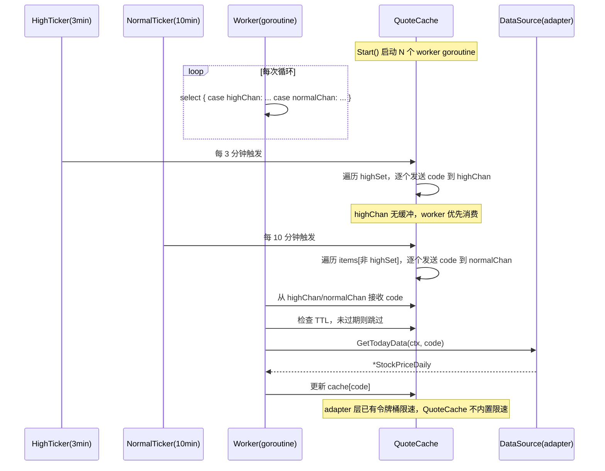
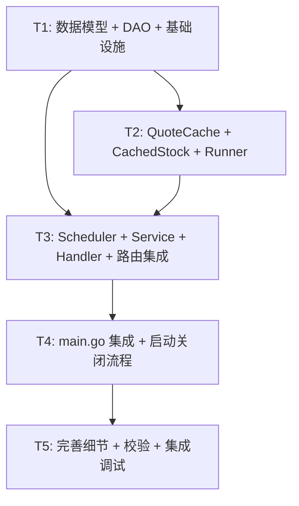

# 策略订阅模块 — 系统设计文档

> 项目：stock-ai · 策略订阅模块
> 版本：v1.0
> 作者：架构师（高见远）
> 日期：2025-07-09

---

## 1. 实现方案概述

本模块在现有 Go (Gin + GORM + MySQL) 三层架构基础上，新增策略订阅功能。核心由三大组件构成：**QuoteCache**（进程内实时行情缓存，chan-based worker pool 双优先级刷新）、**Scheduler**（基于 robfig/cron/v3 的进程内调度引擎，支持热更新）和 **Notifier**（通知推送服务，复用并抽离现有 bot_handler 中的发送逻辑）。

订阅执行流程：Scheduler 定时触发 → 加载订阅配置（含策略条件）→ 按 scope 组装股票列表（全量分批 / 持仓 / 自定义）→ 通过 CachedStock 包装 DBStock 注入缓存行情 → 调用现有 Engine.Execute() 执行选股 → 格式化结果 → 遍历关联机器人发送通知 → 写入执行日志。整个过程保持与现有 `handler → service → dao` 三层架构的一致性，DAO 层使用包级函数，不引入 Repository 模式。

---

## 2. 文件列表及相对路径

### 新增文件

| 文件路径 | 说明 |
|---------|------|
| `internal/model/subscription.go` | 订阅相关数据模型（Subscription、SubscriptionBot、SubscriptionLog） |
| `internal/db/dao_subscription.go` | 订阅 DAO 层（包级函数，CRUD + 关联查询 + 分页） |
| `internal/subscription/quotecache.go` | QuoteCache 进程内行情缓存模块（双优先级 worker pool） |
| `internal/subscription/scheduler.go` | 调度引擎（cron 管理、订阅执行、交易日判断） |
| `internal/subscription/notifier.go` | 通知推送服务（从 bot_handler 抽离 + 模板渲染） |
| `internal/subscription/runner.go` | 订阅执行器（组装股票 → 调引擎 → 结果处理） |
| `internal/subscription/stocksource.go` | CachedStock 实现（嵌入 DBStock，覆盖行情方法注入缓存） |
| `internal/subscription/template.go` | 通知模板定义与渲染（默认三套模板 + 变量替换） |
| `internal/service/subscription_service.go` | 订阅业务逻辑层（CRUD + 手动触发 + 日志查询） |
| `internal/api/handler/subscription_handler.go` | 订阅 HTTP Handler（9 个 API 端点） |
| `internal/api/router/subscription_router.go` | 订阅路由注册（鉴权中间件） |

### 修改文件

| 文件路径 | 修改说明 |
|---------|---------|
| `internal/db/db.go` | AutoMigrate 新增 Subscription、SubscriptionBot、SubscriptionLog 三个模型 |
| `internal/api/router/router.go` | SetupRouter 中新增 RegisterSubscriptionRoutes 调用 |
| `cmd/server/main.go` | 初始化 QuoteCache + Scheduler，优雅关闭时 Stop Scheduler + Close QuoteCache |
| `internal/api/handler/bot_handler.go` | 抽离 dingTalkPayload/sendDingTalk/feishuPayload/wecomPayload/postJSON 到 notifier.go（保持原文件兼容导出） |

---

## 3. 数据结构和接口设计

### 3.1 数据模型

#### Subscription（订阅配置）

```go
// internal/model/subscription.go

package model

import (
    "time"
    "gorm.io/gorm"
)

// MonitorScope 监控范围
type MonitorScope string
const (
    ScopeAll    MonitorScope = "all"    // 全部A股
    ScopeHeld   MonitorScope = "held"   // 用户持仓
    ScopeCustom MonitorScope = "custom" // 自选股票
)

// PresetType 预设频率类型
type PresetType string
const (
    PresetEvery15min PresetType = "every_15min"
    PresetEvery30min PresetType = "every_30min"
    PresetEveryHour  PresetType = "every_hour"
    PresetDailyOpen  PresetType = "daily_open"
    PresetDailyClose PresetType = "daily_close"
    PresetDailyTwice PresetType = "daily_twice"
    PresetWeekly     PresetType = "weekly"
    PresetCustom     PresetType = "custom" // 自定义 cron
)

// LogStatus 执行日志状态
type LogStatus string
const (
    LogStatusSuccess LogStatus = "success"
    LogStatusPartial LogStatus = "partial"
    LogStatusFailed  LogStatus = "failed"
)

// Subscription 订阅配置表
type Subscription struct {
    ID              uint           `gorm:"primarykey" json:"id"`
    UID             uint           `gorm:"index;not null" json:"uid"`
    Name            string         `gorm:"size:100;not null" json:"name"`
    StrategyID      uint           `gorm:"index;not null" json:"strategy_id"`
    Scope           MonitorScope   `gorm:"size:20;not null;default:all" json:"scope"`
    CustomStocks    string         `gorm:"type:text" json:"custom_stocks"`        // JSON: []string（6位代码）
    PresetType      PresetType     `gorm:"size:20;not null;default:every_30min" json:"preset_type"`
    CronExpr        string         `gorm:"size:100" json:"cron_expr"`            // 自定义cron表达式
    TradingHoursOnly bool          `gorm:"default:true" json:"trading_hours_only"`
    IsActive        bool           `gorm:"default:true;index" json:"is_active"`
    Template        string         `gorm:"type:text" json:"template"`            // 用户自定义模板，NULL 用默认
    LastRunAt       *time.Time     `json:"last_run_at"`
    CreatedAt       time.Time      `json:"created_at"`
    UpdatedAt       time.Time      `json:"updated_at"`
    DeletedAt       gorm.DeletedAt `gorm:"index" json:"-"`
}
func (Subscription) TableName() string { return "strategy_subscriptions" }

// SubscriptionBot 订阅-机器人关联表（M2M）
type SubscriptionBot struct {
    ID            uint      `gorm:"primarykey" json:"id"`
    SubscriptionID uint     `gorm:"uniqueIndex:idx_sub_bot;not null" json:"subscription_id"`
    BotID         uint      `gorm:"uniqueIndex:idx_sub_bot;not null" json:"bot_id"`
    CreatedAt     time.Time `json:"created_at"`
}
func (SubscriptionBot) TableName() string { return "subscription_bots" }

// SubscriptionLog 订阅执行日志
type SubscriptionLog struct {
    ID             uint           `gorm:"primarykey" json:"id"`
    SubscriptionID uint           `gorm:"index;not null" json:"subscription_id"`
    RunTime        time.Time      `gorm:"not null" json:"run_time"`
    FinishedAt     *time.Time     `json:"finished_at"`
    Scope          MonitorScope   `gorm:"size:20" json:"scope"`
    TotalScanned   int            `gorm:"default:0" json:"total_scanned"`
    MatchCount     int            `gorm:"default:0" json:"match_count"`
    MatchStocks    string         `gorm:"type:text" json:"match_stocks"`   // JSON: []MatchStock
    DurationMs     int            `gorm:"default:0" json:"duration_ms"`
    Status         LogStatus      `gorm:"size:20;not null" json:"status"`
    ErrorMsg       string         `gorm:"type:text" json:"error_msg"`
    PushStatus     string         `gorm:"type:text" json:"push_status"`   // JSON: map[uint]string
    CreatedAt      time.Time      `json:"created_at"`
}
func (SubscriptionLog) TableName() string { return "subscription_logs" }

// MatchStock 匹配股票（JSON 序列化用）
type MatchStock struct {
    Code  string  `json:"code"`
    Name  string  `json:"name"`
    Price float64 `json:"price"`
}
```

### 3.2 关键 Interface 定义

#### QuoteCache 接口

```go
// internal/subscription/quotecache.go

// QuoteCache 实时行情缓存接口
type QuoteCache interface {
    // Get 获取指定股票的实时行情，缓存未命中时调用 adapter 获取
    Get(ctx context.Context, code string) (*adapter.StockPriceDaily, error)

    // Promote 将股票提升为高优先级（持仓股调用）
    Promote(code string)

    // Demote 将股票降级为普通优先级
    Demote(code string)

    // Refresh 手动触发刷新指定股票（忽略缓存 TTL）
    Refresh(ctx context.Context, code string) (*adapter.StockPriceDaily, error)

    // Start 启动后台刷新 worker
    Start()

    // Stop 停止后台刷新 worker
    Stop()

    // Stats 返回缓存统计信息（命中/未命中/大小等）
    Stats() CacheStats
}

// CacheStats 缓存统计
type CacheStats struct {
    Size         int `json:"size"`
    HighCount    int `json:"high_count"`
    NormalCount  int `json:"normal_count"`
    HitCount     int64 `json:"hit_count"`
    MissCount    int64 `json:"miss_count"`
}
```

#### Notifier 接口

```go
// internal/subscription/notifier.go

// Notifier 通知推送接口
type Notifier interface {
    // Send 通过指定机器人发送消息，失败时自动重试 1 次
    Send(ctx context.Context, bot *model.PushBot, message string) error

    // Render 渲染通知消息（模板 + 变量替换）
    Render(template string, vars map[string]string) string
}
```

#### Scheduler 接口

```go
// internal/subscription/scheduler.go

// Scheduler 调度引擎接口
type Scheduler interface {
    // Start 启动调度引擎（加载活跃订阅 → 注册 cron job → 开始调度）
    Start() error

    // Stop 停止调度引擎（等待当前 job 完成 → 清理 cron）
    Stop()

    // Trigger 手动触发一次订阅执行
    Trigger(subscriptionID uint) error
}
```

### 3.3 ER 关系说明

```
User (1) ──→ (N) Subscription        via UID
Subscription (N) ──→ (1) Strategy   via StrategyID
Subscription (N) ←→ (N) PushBot     via SubscriptionBot（M2M 关联表）
Subscription (1) ──→ (N) SubscriptionLog via SubscriptionID
User (1) ──→ (N) PushBot           via UserID
User (1) ──→ (N) Position          via UID
```

### 3.4 核心实现结构体

#### CachedStock（嵌入 DBStock，覆盖行情方法注入缓存）

```go
// internal/subscription/stocksource.go

// CachedStock 缓存增强版股票数据源
// 嵌入 DBStock，覆盖 GetDailySnapshot 返回缓存的今日行情，
// 其余方法（K线、财报等）委托给 DBStock 从数据库读取。
type CachedStock struct {
    *stocksource.DBStock    // 嵌入：历史数据从 DB 加载
    cache       QuoteCache   // 行情缓存引用
    code        string
    tradeDate   int
}

// 确保 CachedStock 实现 indicator.StockSource
var _ indicator.StockSource = (*CachedStock)(nil)

func NewCachedStock(base *stocksource.DBStock, cache QuoteCache) *CachedStock

// 覆盖 DBStock 的 GetDailySnapshot —— 优先从 QuoteCache 获取今日行情
func (c *CachedStock) GetDailySnapshot() (*model.StockDailySnapshot, error)

// 覆盖 GetDailyKline —— 拼接今日行情到 K线头部（使技术指标能取到最新价格）
func (c *CachedStock) GetDailyKline() ([]*model.DailyKline, error)
```

#### quoteCacheImpl（缓存实现体）

```go
// internal/subscription/quotecache.go

type quoteCacheImpl struct {
    mu           sync.RWMutex
    items        map[string]*cacheItem        // code → 缓存项
    highSet      map[string]struct{}           // 高优先级集合
    highChan     chan string                    // 高优先级刷新通道
    normalChan   chan string                    // 普通优先级刷新通道
    dataSource   adapter.DataSource            // 数据源适配器
    highTicker   *time.Ticker                  // 3 分钟刷新高优先级
    normalTicker *time.Ticker                  // 10 分钟刷新普通优先级
    highTTL      time.Duration                 // 5 分钟
    normalTTL    time.Duration                 // 15 分钟
    stopCh       chan struct{}
    wg           sync.WaitGroup
    stats        struct { hit, miss int64 }    // 原子统计
}

type cacheItem struct {
    data      *adapter.StockPriceDaily
    fetchedAt time.Time
    priority  string  // "high" 或 "normal"
}
```

---

## 4. 程序调用流程

### 4.1 单次订阅执行完整流程（时序图）



### 4.2 QuoteCache 刷新流程（时序图）



### 4.3 Scheduler 生命周期（流程图）

```mermaid
flowchart TD
    A[main.go: 初始化] --> B[NewQuoteCache(dataSource)]
    B --> C[NewScheduler(cache, engine, notifier)]
    C --> D[scheduler.Start]
    D --> E[从 DB 加载所有 is_active=true 的订阅]
    E --> F{遍历每个订阅}
    F --> G[解析 cron 表达式<br/>preset_type → cron 或用户自定义 cron]
    G --> H[注册 cron job<br/>jobFunc: scheduler.runSubscription]
    H --> F
    F -->|遍历完毕| I[调度引擎运行中<br/>cron 按表达式触发 job]

    I --> J{job 触发}
    J --> K[从 DB 重新加载订阅配置<br/>热更新]
    K --> L{is_active?}
    L -->|false| M[跳过此订阅]
    L -->|true| N[调用 runner.Run]
    N --> O[记录执行日志]
    O --> I

    I -->|收到 SIGINT/SIGTERM| P[scheduler.Stop]
    P --> Q[cron.Stop() 等待当前 job 完成]
    Q --> R[quoteCache.Stop() 停止 worker]
    R --> S[优雅关闭完成]
```

---

## 5. 任务列表（按实现顺序排列，最多 5 个）

### T1: 数据模型 + DAO + 基础设施

**涉及文件（8 个）：**

| 操作 | 文件路径 |
|------|---------|
| 新增 | `internal/model/subscription.go` |
| 新增 | `internal/db/dao_subscription.go` |
| 修改 | `internal/db/db.go`（AutoMigrate 新增三个模型） |
| 新增 | `go.mod`（新增 `github.com/robfig/cron/v3` 依赖） |
| 修改 | `internal/api/handler/bot_handler.go`（抽离发送函数到 notifier） |
| 新增 | `internal/subscription/notifier.go`（抽离后的发送函数 + Notifier 实现） |
| 新增 | `internal/subscription/template.go`（三套默认模板 + 变量替换） |
| 新增 | `internal/api/router/subscription_router.go`（骨架路由，先注册空 handler） |

**依赖：** 无

**实现要点：**

- `model/subscription.go`：定义 `Subscription`、`SubscriptionBot`、`SubscriptionLog`、`MatchStock` 四个 struct，含完整 GORM tag 和 JSON tag。`Subscription` 使用 `gorm.DeletedAt` 软删除。
- `db/dao_subscription.go`：包级函数，包括：
  - `CreateSubscription(sub *model.Subscription) error`
  - `GetSubscriptionByID(id, uid uint) (*model.Subscription, error)`
  - `ListSubscriptions(uid uint, page, pageSize int) ([]model.Subscription, int64, error)`
  - `UpdateSubscription(sub *model.Subscription) error`
  - `DeleteSubscription(id, uid uint) error`
  - `SetActive(id, uid uint, active bool) error`
  - `GetActiveSubscriptions() ([]model.Subscription, error)`（Scheduler 启动时用，不按 uid 过滤）
  - `SetSubscriptionBots(subscriptionID uint, botIDs []uint) error`（全量替换）
  - `GetSubscriptionBots(subscriptionID uint) ([]model.PushBot, error)`（JOIN 查询）
  - `CreateSubscriptionLog(log *model.SubscriptionLog) error`
  - `ListSubscriptionLogs(subscriptionID uint, page, pageSize int, status string) ([]model.SubscriptionLog, int64, error)`
  - `UpdateLastRunTime(id uint) error`
  - `CountUserSubscriptions(uid uint) (int64, error)`（上限 20 校验用）
- `db.go`：AutoMigrate 中追加 `&model.Subscription{}`, `&model.SubscriptionBot{}`, `&model.SubscriptionLog{}`
- `go.mod`：`go get github.com/robfig/cron/v3`
- `bot_handler.go`：将 `dingTalkPayload`, `sendDingTalk`, `dingTalkSign`, `feishuPayload`, `wecomPayload`, `postJSON` 六个函数的**签名和实现**原样移到 `notifier.go`，`bot_handler.go` 中保留调用（通过包内可见性直接调用，无需 import 变化）。
- `notifier.go`：定义 `Notifier` 接口和 `notifierImpl` struct，实现 `Send(ctx, bot, message)` 和 `Render(template, vars)` 方法。`Send` 内部按 `bot.Channel` 分发到不同 payload 构建函数，失败时自动重试 1 次。
- `template.go`：定义三套默认模板常量（`defaultSuccessTemplate`、`defaultEmptyTemplate`、`defaultErrorTemplate`），实现 `RenderTemplate(tpl string, vars map[string]string) string` 函数，使用 `strings.ReplaceAll` 替换 `{variable_name}` 占位符。
- `subscription_router.go`：骨架路由注册函数 `RegisterSubscriptionRoutes(apiV1, authSvc, subSvc)`，8 个端点全部挂载但先指向空 handler（后续 T3 完善）。

---

### T2: QuoteCache + CachedStock + Runner（核心执行引擎）

**涉及文件（3 个）：**

| 操作 | 文件路径 |
|------|---------|
| 新增 | `internal/subscription/quotecache.go` |
| 新增 | `internal/subscription/stocksource.go` |
| 新增 | `internal/subscription/runner.go` |

**依赖：** T1

**实现要点：**

- `quotecache.go`：
  - `NewQuoteCache(ds adapter.DataSource, workerCount int) QuoteCache`：构造函数，workerCount 默认 3
  - `Start()`：启动 worker goroutine + 两个 Ticker（3min / 10min）
  - `Stop()`：关闭 ticker、关闭 channel、等待 worker 退出
  - `Get(ctx, code)`：RLock → 检查 TTL → 命中返回 / 未命中调用 `dataSource.GetTodayData` 并写入缓存
  - `Promote(code)` / `Demote(code)`：修改 `highSet`，同步更新 cacheItem.priority
  - `Refresh(ctx, code)`：强制刷新（忽略 TTL）
  - `Stats()`：返回缓存统计
  - **worker 函数**：`select` 优先消费 `highChan`，空闲时消费 `normalChan`
  - **不内置限速器**：`dataSource` (adapter 层) 已有令牌桶

- `stocksource.go`：
  - `CachedStock` struct：嵌入 `*stocksource.DBStock` + `QuoteCache` 引用
  - `NewCachedStock(base *stocksource.DBStock, cache QuoteCache) *CachedStock`
  - `GetCode()` / `GetName()`：直接委托给嵌入的 DBStock
  - `GetDailySnapshot()`：**覆盖** DBStock 的方法，调用 `cache.Get()` 获取今日行情，转换为 `*model.StockDailySnapshot` 格式返回（适配 indicator.MarketSource 接口）
  - `GetDailyKline()`：**覆盖** DBStock 的方法，先获取 DB 历史K线，再从 cache 获取今日行情，拼接为最新 K线头部返回（使技术指标 MA/MACD 等能取到最新价格）
  - 编译期断言：`var _ indicator.StockSource = (*CachedStock)(nil)`

- `runner.go`：
  - `SubscriptionRunner` struct：持有 `QuoteCache`、`*indicator.Engine`、`Notifier`、`SubscriptionService`（用于写日志）
  - `NewSubscriptionRunner(...) *SubscriptionRunner`
  - `Run(ctx context.Context, sub *model.Subscription) (*RunResult, error)` 核心方法：
    1. 从 DB 加载关联的 strategy（解析 Conditions JSON → `[]indicator.SignalConfig`）和 bots
    2. 调用 `resolveStockCodes(sub)` 按 scope 获取股票代码列表
    3. 调用 `db.LoadAllStockCodes()` 获取全量股票（scope=all 时直接使用）
    4. 构建 `[]indicator.StockSource`：先 `stocksource.NewDBStock()` 再包装为 `NewCachedStock()`
    5. scope=all 时：500 只/批分批，批内 `Engine.Execute(stocks, configs, 50)` 并发 50
    6. scope=held/custom 时：直接 `Engine.Execute(stocks, configs, 10)` 并发 10
    7. 过滤 `ResultPassed` 结果，组装 `[]MatchStock`
    8. 调用 `Notifier.Render()` 渲染模板
    9. 遍历 bots 调用 `Notifier.Send()`，收集 pushStatus
    10. 写入 `SubscriptionLog`
    11. 更新 `Subscription.LastRunAt`
  - `resolveStockCodes(sub)`：scope=all → `db.LoadAllStockCodes()`；scope=held → `db.ListPositions(uid, "holding", ...)`；scope=custom → 解析 `sub.CustomStocks` JSON
  - `RunResult` struct：`LogID, Status, TotalScanned, MatchCount, DurationMs`

---

### T3: Scheduler + Service + Handler + 路由集成（业务层 + API 层）

**涉及文件（4 个）：**

| 操作 | 文件路径 |
|------|---------|
| 新增 | `internal/subscription/scheduler.go` |
| 新增 | `internal/service/subscription_service.go` |
| 新增 | `internal/api/handler/subscription_handler.go` |
| 修改 | `internal/api/router/router.go` |

**依赖：** T1, T2

**实现要点：**

- `scheduler.go`：
  - `schedulerImpl` struct：持有 `cron.Cron`、`QuoteCache`、`SubscriptionRunner`、`map[uint]cron.EntryID`（订阅ID → cron job ID）
  - `NewScheduler(cache, engine, notifier) *schedulerImpl`
  - `Start()`：
    1. 创建 `cron.New(cron.WithSeconds())`（支持秒级精度，备用）
    2. 从 DB 加载所有 `is_active=true` 的订阅
    3. 遍历注册 cron job：`presetTypeToCron(sub.PresetType)` 或 `sub.CronExpr`
    4. 启动 `cron.Start()`
  - `Stop()`：`cron.Stop()` + `cron.Wait()`
  - `Trigger(subscriptionID uint)`：手动触发执行（供 handler 调用）
  - `runSubscription(subscriptionID uint)`：cron job 回调函数
    1. 从 DB 重新加载订阅配置（热更新）
    2. 检查 `is_active`
    3. 检查 `trading_hours_only` + `IsTradingDay()` + `IsTradingHours()`
    4. 调用 `runner.Run(ctx, sub)`
  - `presetTypeToCron(preset PresetType) string`：预设映射函数
  - `IsTradingDay() bool`：判断今天是否交易日（排除周末，内置节假日列表，未来可扩展）
  - `IsTradingHours() bool`：判断当前时间是否在 9:15-15:00

- `subscription_service.go`：
  - `SubscriptionService` struct（无状态，`NewSubscriptionService()` 构造）
  - `Create(req *CreateSubscriptionReq, uid uint) (*SubscriptionDetail, error)`：校验 strategy 归属 → 检查订阅上限 20 → 创建订阅 → 设置 bots 关联
  - `GetByID(id, uid uint) (*SubscriptionDetail, error)`：查订阅 + JOIN strategy 名 + bots
  - `List(uid uint, page, pageSize int, isActive *bool) (*SubscriptionListResp, error)`：分页 + 可选 is_active 过滤
  - `Update(id, uid uint, req *UpdateSubscriptionReq) (*SubscriptionDetail, error)`：校验归属 → 更新字段
  - `Delete(id, uid uint) error`：软删除 + 清理 subscription_bots 关联
  - `SetActive(id, uid uint, active bool) error`
  - `UpdateBots(id, uid uint, botIDs []uint) error`：全量替换关联，校验上限 5 个 + 每个 bot 归属当前用户
  - `GetLogs(id, uid uint, page, pageSize int, status string) (*LogListResp, error)`
  - `TriggerRun(id, uid uint) (*TriggerResult, error)`：校验归属 + is_active → 调用 scheduler.Trigger(id)
  - 请求/响应结构体：`CreateSubscriptionReq`, `UpdateSubscriptionReq`, `SubscriptionDetail`, `SubscriptionListItem`, `BotInfo`, `TriggerResult` 等

- `subscription_handler.go`：
  - `SubscriptionHandler` struct：持有 `*service.SubscriptionService`
  - `NewSubscriptionHandler(svc *service.SubscriptionService) *SubscriptionHandler`
  - 8 个方法对应 8 个 API 端点：
    - `Create(c *gin.Context)` → POST /subscriptions
    - `List(c *gin.Context)` → GET /subscriptions
    - `GetByID(c *gin.Context)` → GET /subscriptions/:id
    - `Update(c *gin.Context)` → PUT /subscriptions/:id
    - `Delete(c *gin.Context)` → DELETE /subscriptions/:id
    - `SetActive(c *gin.Context)` → PATCH /subscriptions/:id/active
    - `TriggerRun(c *gin.Context)` → POST /subscriptions/:id/run
    - `UpdateBots(c *gin.Context)` → PUT /subscriptions/:id/bots
  - Handler 从 `c.GetUint("user_id")` 获取当前用户
  - 统一响应格式：`c.JSON(http.StatusOK, gin.H{"code": 0, "data": ...})` 或 `gin.H{"code": xxx, "message": "..."}`

- `router.go`：
  - `SetupRouter()` 中追加 `RegisterSubscriptionRoutes(apiV1, authSvc, subSvc)`
  - `subSvc` 由 `router` 包内创建：`service.NewSubscriptionService()`
  - 注意：Scheduler 在 `main.go` 初始化，不在 router 层创建

---

### T4: main.go 集成 + 启动/关闭流程

**涉及文件（2 个）：**

| 操作 | 文件路径 |
|------|---------|
| 修改 | `cmd/server/main.go` |
| 修改 | `internal/api/router/router.go`（如需调整 Scheduler 注入方式） |

**依赖：** T3

**实现要点：**

- `main.go` 修改点：
  1. 在 adapter 注册完成后，获取默认数据源：`ds, _ := registry.Get("eastmoney")`（获取优先级最高的可用数据源）
  2. 创建 QuoteCache：`cache := subscription.NewQuoteCache(ds, 3)`，调用 `cache.Start()`
  3. 创建指标注册表（复用 `allBuiltins()`）：`reg := indicator.NewRegistry(handler.AllBuiltins())`（需要将 `allBuiltins` 改为导出 `AllBuiltins`）
  4. 创建 Notifier：`notifier := subscription.NewNotifier()`
  5. 创建 SubscriptionRunner：`runner := subscription.NewSubscriptionRunner(cache, reg.Engine(), notifier)`
  6. 创建 Scheduler：`scheduler := subscription.NewScheduler(cache, reg.Engine(), notifier)`
  7. 调用 `scheduler.Start()`
  8. 将 `subSvc` 传入 router（需要修改 `SetupRouter` 签名或使用全局注入）
  9. 优雅关闭：`scheduler.Stop()` → `cache.Stop()` → `srv.Shutdown()` → `registry.CloseAll()`
- `router.go`：`SetupRouter` 签名可能需要接受 `subSvc` 参数，或在 main.go 中直接调用 `RegisterSubscriptionRoutes` 后追加路由组

---

### T5: 完善细节 + 校验逻辑 + 集成调试

**涉及文件（前序所有修改文件 + 潜在微调）：**

| 操作 | 文件路径 |
|------|---------|
| 修改 | `internal/subscription/runner.go`（超时保护、错误恢复） |
| 修改 | `internal/subscription/scheduler.go`（交易日历、cron 校验） |
| 修改 | `internal/service/subscription_service.go`（入参校验完善） |
| 修改 | `internal/api/handler/subscription_handler.go`（边界 case 处理） |

**依赖：** T4

**实现要点：**

- `runner.go`：
  - 添加单次扫描总体超时保护（10 分钟 `context.WithTimeout`）
  - scope=all 分批时，单批超时 2 分钟
  - panic recover：单个股票评估 panic 不影响整体执行
- `scheduler.go`：
  - 完善 `IsTradingDay()`：内置 2025 年 A 股交易日历（排除周末 + 法定节假日列表）
  - cron 表达式校验：使用 `cron.ParseStandard()` 校验用户自定义 cron 表达式合法性
  - Scheduler 启动时日志输出：注册了多少个订阅 job
- `subscription_service.go`：
  - `Create`：校验 strategy_id 存在且归属当前用户；校验 cron_expr 合法性（preset=custom 时）；校验 custom_stocks 每项为 6 位纯数字
  - `UpdateBots`：校验每个 bot_id 存在且归属当前用户；上限 5 个
  - 通用分页参数校验：page >= 1，pageSize 范围 [1, 100]
- `subscription_handler.go`：
  - `TriggerRun`：订阅不存在或未激活时返回明确错误
  - 统一错误码规范：参数错误 400 / 未授权 401 / 未找到 404 / 服务端错误 500

---

## 6. 依赖包列表

| 包名 | 版本 | 用途 |
|------|------|------|
| `github.com/robfig/cron/v3` | v3 | 进程内 cron 调度引擎 |

**说明：** 其余依赖（gin、gorm、mysql driver、x/time、jwt）均为项目已有依赖，无需新增。

---

## 7. 共享知识

### 7.1 架构约定

- **三层架构**：`Router → Handler → Service → DAO(db包级函数) → Model`
- **DAO 层**：使用 `db.GetDB()` 全局 GORM 实例的包级函数，不用 Repository struct
- **Service 层**：无状态 struct + `New*()` 构造器，不持有 DB 连接
- **Handler 层**：从 `c.GetUint("user_id")` 获取当前用户 ID，通过 `middleware.AuthRequired` 注入
- **路由注册**：在 `router/router.go` 的 `SetupRouter()` 中统一注册，各模块有独立的 `RegisterXxxRoutes` 函数
- **响应格式**：`gin.H{"code": 0, "data": ..., "message": ...}`

### 7.2 命名规范

- 文件命名：`snake_case.go`
- DAO 函数：`CreateXxx`, `GetXxx`, `ListXxx`, `UpdateXxx`, `DeleteXxx`（包级函数）
- Service 方法：`Create`, `GetByID`, `List`, `Update`, `Delete`, `SetActive`（接收者方法）
- Handler 方法：与 API 路径对应，如 `Create`, `List`, `GetByID`, `Update`, `Delete`
- 中文注释：所有新增代码使用中文注释

### 7.3 错误处理模式

- DAO 层：`db.ErrRecordNotFound` 用于"记录不存在"语义（`errors.New("记录不存在")`）
- Service 层：返回 error 给 Handler，由 Handler 决定 HTTP 状态码
- Handler 层：`c.JSON(http.StatusBadRequest, gin.H{"error": "..."})` 直接返回错误
- 软删除：使用 `gorm.DeletedAt` 类型字段，GORM 自动过滤已删除记录

### 7.4 复用已有代码

| 已有代码 | 复用方式 |
|---------|---------|
| `db.LoadAllStockCodes()` | scope=all 时直接调用获取全量股票 |
| `stocksource.NewDBStock(detail, tradeDate)` | 构建 DBStock 基础数据源，再包装为 CachedStock |
| `indicator.Engine.Execute(stocks, configs, maxConcurrency)` | 核心选股引擎，直接复用 |
| `handler.allBuiltins()` → 需改为 `handler.AllBuiltins()` | main.go 中构建指标注册表 |
| `dingTalkPayload/sendDingTalk/feishuPayload/wecomPayload/postJSON` | 从 bot_handler.go 抽离到 notifier.go，包内可见性不变 |
| `db.ErrRecordNotFound` | DAO 层统一"记录不存在"错误 |
| `middleware.AuthRequired(authSvc)` | 路由鉴权中间件 |
| `parseID(c)` | bot_handler.go 中的 URL ID 解析辅助函数，subscription_handler 可复用 |
| `utils.ConcurrentExec(tasks, max, fn)` | 分批并发执行工具 |

### 7.5 关键设计决策

1. **QuoteCache 全局共享**：股票行情与用户无关，全局单例缓存最简单高效
2. **不内置限速器**：adapter 层已有 `golang.org/x/time/rate` 令牌桶限速，QuoteCache 不重复限速
3. **CachedStock 嵌入 DBStock**：通过 Go 嵌入 + 方法覆盖，实现行情缓存注入，最小化对现有 StockSource 接口的影响
4. **热更新而非重启**：每次 cron 触发时从 DB 重新加载配置，用户修改订阅后无需重启服务
5. **交易日历内置**：首期硬编码 2025 年 A 股交易日历（排除周末 + 法定节假日），每年更新
6. **通知纯文本**：首期统一纯文本格式，后续按需适配各平台富文本

### 7.6 GORM 软删除注意

- 所有用户资源表使用 `gorm.DeletedAt` 字段实现软删除
- GORM 查询自动过滤 `deleted_at IS NULL` 的记录
- `db.DeleteSubscription(id, uid)` 使用 `GetDB().Delete()` 触发软删除
- `subscription_bots` 表在订阅软删除时需手动清理（CASCADE 不作用于 GORM 软删除）
- `subscription_logs` 表**不做软删除**（日志需永久保留）

---

## 8. 任务依赖图



> **说明：** T2 和 T3 在 T1 完成后可并行开发（T3 依赖 T2 的接口定义但不依赖其实现细节），T4 是最终集成，T5 是收尾打磨。
